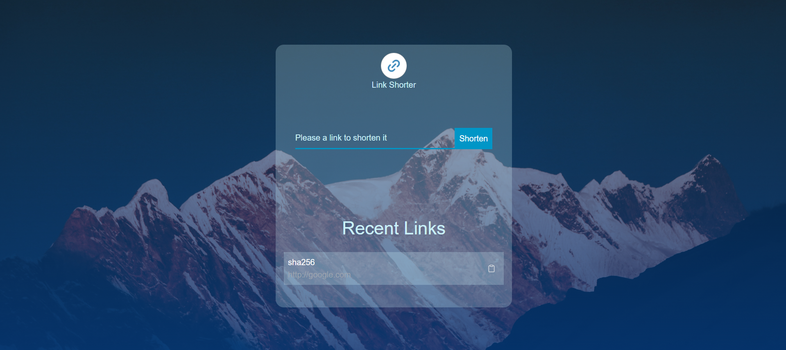

# React Shorter Link

A simple front-end project for a link shortener. This project attempts to implement a simple link shortener application. You can use this project for your basic exercises. This project uses React natively, and Tailwind CSS and Sass are used for styling, which you can change.


## Installation

Just clone the project.

```bash
  git clone https://github.com/mammaadDeveloper/react-shorter-link.git
```

Then enter the project directory and enter the command to install the dependencies.
```bash
{npm|yarn|pnpm|bun} install
```

And run the application with the following commands.
```bash
{npm|yarn|pnpm|bun} {run?} dev
```
    
## Demo

Insert gif or link to demo



## 🔗 Links

[](https://www.linkedin.com/in/mammaad-developer-3298b5336/)


## License
This repository is licensed under the [MIT](./LICENSE) license.
[MIT](https://choosealicense.com/licenses/mit/)

